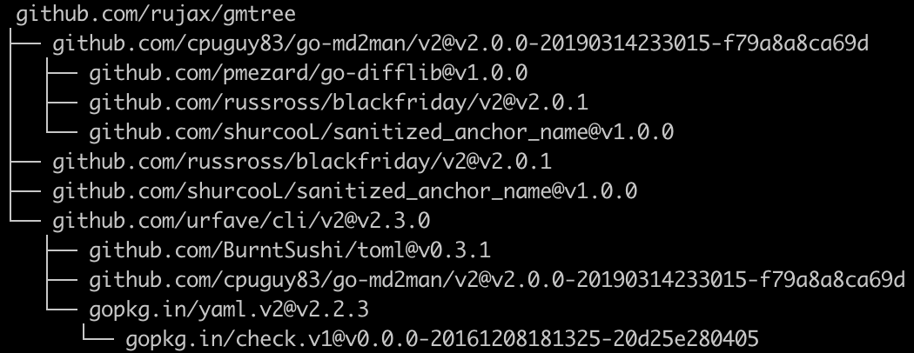
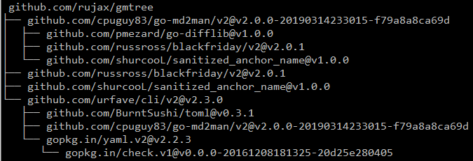
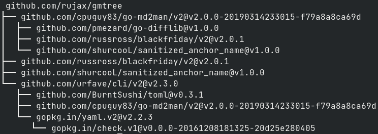

# gmtree

Generate treeview for command "`go mod graph`" .

## Requirements

* Go: 1.16+
* Go Mods: [go.mod](go.mod)

## Install

```bash
$ go get -u https://github.com/rujax/gmtree
```

## Docker

```bash
$ docker build -t rujax/gmtree .
...
$ go mod graph | docker run -i rujax/gmtree
```

## Argument

| Name                | Alias | Type     | Default Value |
|---------------------|-------|----------|---------------|
| --indent            | -i    | int      | 2             |
 | --filter            | -f    | []string |               |
 | --filter-no-version | -n    | []string |               |

## Usage

Print treeview on Stdout

```bash
$ go mod graph | gmtree # Indent: 2
 github.com/rujax/gmtree
├── github.com/cpuguy83/go-md2man/v2@v2.0.0-20190314233015-f79a8a8ca69d
│  ├── github.com/pmezard/go-difflib@v1.0.0
│  ├── github.com/russross/blackfriday/v2@v2.0.1
│  └── github.com/shurcooL/sanitized_anchor_name@v1.0.0
├── github.com/russross/blackfriday/v2@v2.0.1
├── github.com/shurcooL/sanitized_anchor_name@v1.0.0
└── github.com/urfave/cli/v2@v2.3.0
   ├── github.com/BurntSushi/toml@v0.3.1
   ├── github.com/cpuguy83/go-md2man/v2@v2.0.0-20190314233015-f79a8a8ca69d
   └── gopkg.in/yaml.v2@v2.2.3
      └── gopkg.in/check.v1@v0.0.0-20161208181325-20d25e280405
```

Print treeview with custom indent
```bash
$ go mod graph | gmtree -i n # Indent: n
```

Prune treeview to just ancestors and self of specific dependency

```bash
$ go mod graph | ./gmtree -f github.com/shurcooL/sanitized_anchor_name@v1.0.0
 github.com/rujax/gmtree
├── github.com/cpuguy83/go-md2man/v2@v2.0.0-20190314233015-f79a8a8ca69d
│  └── github.com/shurcooL/sanitized_anchor_name@v1.0.0
└── github.com/shurcooL/sanitized_anchor_name@v1.0.0
```

Prune treeview to just ancestors and self of unversioned dependency

```bash
$ go mod graph | ./gmtree -n github.com/shurcooL/sanitized_anchor_name
 github.com/rujax/gmtree
├── github.com/cpuguy83/go-md2man/v2@v2.0.0-20190314233015-f79a8a8ca69d
│  └── github.com/shurcooL/sanitized_anchor_name@v1.0.0
└── github.com/shurcooL/sanitized_anchor_name@v1.0.0
```

Save treeview to file

```bash
$ go mod graph | gmtree > treeview_file_path
```


## Example

Mac



Windows



Linux


